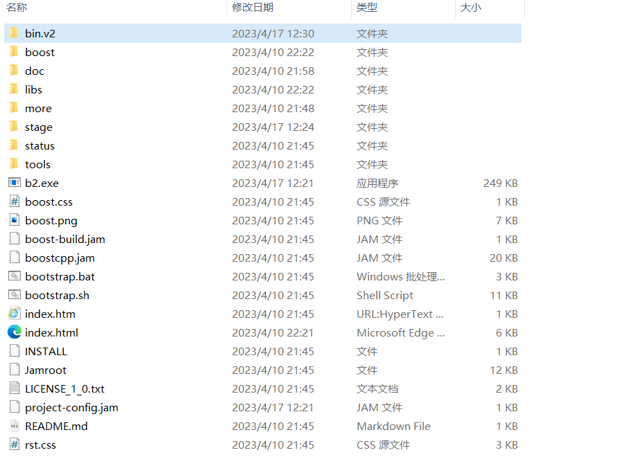

# Boost的安装

该安装过程仅供参考，平台不同可能会有所差异，详细请移步[官方文档]()

## 我的环境
Windows 10

## 获取Boost
版本 1.82.0 [下载链接](https://boostorg.jfrog.io/artifactory/main/release/1.82.0/source/boost_1_82_0.zip)

## 编译
下载完成后，打开可以看到这样的目录结构：



添加环境变量 `BOOST_ROOT` ，值为 `boost` 文件夹所在的目录之后代开控制台，执行解压目录下的 `bootstrap.bat`(这个是windows平台下的执行脚本)，执行过后，会看到提示，让我们执行`.\b2`
其实还有很多编译选项，执行 `b2 --help` 查看

这里直接执行`b2.exe`即可,等待结束后，在`stage/lib`下生成了很多lib文件,每个lib有两个版本，根据自己的需要选择

## 测试运行
### 环境
- Windows10
- g++ 8.1.0
### 代码
代码来源于`boost`库自带的`example`，功能是按照`order`中下标的顺序，重新排列`vec`
详细信息可以查看[官方文档](https://www.boost.org/doc/libs/1_82_0/)
```cpp
/*
  Copyright (c) Alexander Zaitsev <zamazan4ik@gmail.com>, 2017

  Distributed under the Boost Software License, Version 1.0. (See
  accompanying file LICENSE_1_0.txt or copy at
  http://www.boost.org/LICENSE_1_0.txt)

  See http://www.boost.org/ for latest version.
*/

#include <vector>
#include <iostream>

#include <boost/algorithm/apply_permutation.hpp>


namespace ba = boost::algorithm;

int main ( int /*argc*/, char * /*argv*/ [] )
{
    // WARNING: Example require C++11 or newer compiler
    {
        std::cout << "apply_permutation with iterators:\n";
        std::vector<int> vec{1, 2, 3, 4, 5}, order{4, 2, 3, 1, 0};

        ba::apply_permutation(vec.begin(), vec.end(), order.begin(), order.end());
        for (const auto& x : vec)
        {
            std::cout << x << ", ";
        }
        std::cout << std::endl;
    }
    {
        std::cout << "apply_reverse_permutation with iterators:\n";
        std::vector<int> vec{1, 2, 3, 4, 5}, order{4, 2, 3, 1, 0};

        ba::apply_reverse_permutation(vec.begin(), vec.end(), order.begin(), order.end());
        for (const auto& x : vec)
        {
            std::cout << x << ", ";
        }
        std::cout << std::endl;
    }
    {
        std::cout << "apply_reverse_permutation with ranges:\n";
        std::vector<int> vec{1, 2, 3, 4, 5}, order{4, 2, 3, 1, 0};

        ba::apply_reverse_permutation(vec, order);
        for (const auto& x : vec)
        {
            std::cout << x << ", ";
        }
        std::cout << std::endl;
    }
    {
        std::cout << "apply_permutation with ranges:\n";
        std::vector<int> vec{1, 2, 3, 4, 5}, order{4, 2, 3, 1, 0};

        ba::apply_permutation(vec, order);
        for (const auto& x : vec)
        {
            std::cout << x << ", ";
        }
        std::cout << std::endl;
    }

    return 0;
}
```
编译代码:
`g++ apply_permutation_example.cpp -o main -L libs/libboost_container-vc143-mt-x64-1_82.lib -I D:/cpplib/boost_1_82_0/boost_1_82_0`
运行结果：

```
apply_permutation with iterators:
5, 3, 4, 2, 1,
apply_reverse_permutation with iterators:
5, 4, 2, 3, 1,
apply_reverse_permutation with ranges:
5, 4, 2, 3, 1,
apply_permutation with ranges:
5, 3, 4, 2, 1,
```