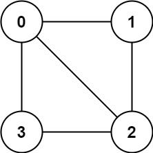

# 判断二分图
<small>题目来源：leetcode 785</small>
## 题目描述
存在一个 无向图 ，图中有 `n` 个节点。其中每个节点都有一个介于 `0` 到 `n - 1` 之间的唯一编号。
给你一个二维数组 `graph` ，其中 `graph[u]` 是一个节点数组，由节点 `u` 的邻接节点组成。形式上，对于 `graph[u]` 中的每个 `v` ，都存在一条位于节点 `u` 和节点 `v` 之间的无向边。该无向图同时具有以下属性：
不存在自环（`graph[u]` 不包含 `u`）。
不存在平行边（`graph[u]` 不包含重复值）。
如果 `v` 在 `graph[u]` 内，那么 `u` 也应该在 `graph[v]` 内（该图是无向图）
这个图可能不是连通图，也就是说两个节点 u 和 v 之间可能不存在一条连通彼此的路径。
二分图 定义：如果能将一个图的节点集合分割成两个独立的子集 `A` 和 `B` ，并使图中的每一条边的两个节点一个来自 A 集合，一个来自 B 集合，就将这个图称为 二分图 。

如果图是二分图，返回 `true`；否则，返回 `false`。

### 示例1

```
输入：graph = [[1,2,3],[0,2],[0,1,3],[0,2]]
输出：false
解释：不能将节点分割成两个独立的子集，以使每条边都连通一个子集中的一个节点与另一个子集中的一个节点。
```
### 示例2

```
输入：graph = [[1,3],[0,2],[1,3],[0,2]]
输出：true
解释：可以将节点分成两组: {0, 2} 和 {1, 3} 。
```
## 题目分析
题目要求我们对图中任意一条边的两个节点进行分割，使其位于不同的集合。如果对每一条边都进行分割，则最终结果图中的所有节点被分成两个集合。
如果在分集合过程中，发生了冲突，则该图就不是二分图。
过程：
首先，维护一个并查集，并初始化每一个节点的父节点为节点本身。遍历graph数组，如果与节点相邻的节点已经合并过了，说明当前这对节点就无法被分离。

## 解题策略
- 并查集

## 代码实现
```python
class Solution:
    def isBipartite(self, graph: List[List[int]]) -> bool:
        uf: 'UnionFind' = UnionFind(len(graph))
        for index, node in enumerate(graph):
            # 查看该节点与相邻的节点是否合并过
			for n in node:
                if uf.isConnected(index, n):
                    return False
             # 合并 node 中的节点
            for i in range(len(node) - 1):
                uf.union(node[i], node[i + 1])
        return True


class UnionFind:
    def __init__(self, n: int):
        self.parent: List[int] = [i for i in range(n)]
        self.weight: List[int] = [1 for i in range(n)]

    def find(self, p: int) -> int:
        if p != self.parent[p]:
            self.parent[p] = self.find(self.parent[p])
        return self.parent[p]

    def union(self, p: int, q: int) -> None:
        pRoot: int = self.find(p)
        qRoot: int = self.find(q)
        if self.weight[pRoot] > self.weight[qRoot]:
            self.parent[qRoot] = pRoot
            self.weight[pRoot] += self.weight[qRoot]
        else:
            self.parent[pRoot] = qRoot
            self.weight[qRoot] += self.weight[pRoot]

    def isConnected(self, p: int, q: int) -> bool:
        return self.find(p) == self.find(q)
```
