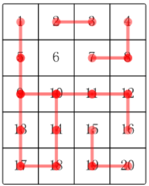

# 合根植物
<small>题目来源： 蓝桥杯 2017 国赛</small>

## 题目描述
$w$ 星球的一个种植园，被分成 $m×n$ 个小格子（东西方向 $m$ 行，南北方向 $n$ 列）。每个格子里种了一株合根植物。
这种植物有个特点，它的根可能会沿着南北或东西方向伸展，从而与另一个格子的植物合成为一体。S如果我们告诉你哪些小格子间出现了连根现象，你能说出这个园中一共有多少株合根植物吗？

## 输入描述
第一行，两个整数 $m,n$，用空格分开，表示格子的行数、列数（$1 \leq m,n \leq 1000$）。接下来一行，一个整数 $k (0 \leq k \leq 10^5)$，表示下面还有 $k$ 行数据。接下来 $k$ 行，每行两个整数 $a,b$，表示编号为 $a$ 的小格子和编号为 $b$ 的小格子合根了。
格子的编号一行一行，从上到下，从左到右编号。比如：$5 \times 4$ 的小格子，编号：
```
1 2 3 4
5 6 7 8
9 10 11 12
13 14 15 16
17 18 19 20
```
## 输出描述
输出植物的数量

## 输入输出样例
### 示例
> 输入
```
5 4
16
2 3
1 5
5 9
4 8
7 8
9 10
10 11
11 12
10 14
12 16
14 18
17 18
15 19
19 20
9 13
13 17
```
> 输出
```
5
```
> 样例说明



## 题目分析
方格中不同的合根植物连在一起后，会使方格中出现不同的集合。

> 转化问题

给出一个$m \times n$的方格，输入会告诉你哪些位置上的方格是连通的，问最终方格上一共有多少个连通区域?
## 解题策略
- 深度优先搜索
- 广度优先搜索
- 并查集

## 代码实现
> 深度优先搜索

> 广度优先搜搜

> 并查集
```python
from typing import List


class UnionFind:
    def __init__(self, n: int):
        self.parent: List[int] = [i for i in range(n)]
        self.size: List[int] = [1 for i in range(n)]
        # sets 表示当前并查集中集合的数量
        self.sets: int = n

	# 查找节点的祖先节点
    def findWithPathCompress(self, p: int) -> int:
        if p != self.parent[p]:
            self.parent[p] = self.findWithPathCompress(self.parent[p])
        return self.parent[p]

	# 合并两个节点
    def unionWithWeighted(self, p: int, q: int) -> None:
        qRoot: int = self.findWithPathCompress(q)
        pRoot: int = self.findWithPathCompress(p)
        if self.size[qRoot] > self.size[pRoot]:
            self.parent[pRoot] = qRoot
            self.size[qRoot] += self.size[pRoot]
        else:
            self.parent[qRoot] = pRoot
            self.size[pRoot] += self.size[qRoot]
        self.sets -= 1

    # 判断两个节点是否位于一个集合中
    def isConnected(self, p: int, q: int) -> bool:
        return self.findWithPathCompress(p) == self.findWithPathCompress(q)


m, n = map(int, input().split())
k = int(input())
uf: 'UnionFind' = UnionFind(m * n + 1)
for i in range(k):
    loc_1, loc_2 = map(int, input().split())
    if not uf.isConnected(loc_1, loc_2):
        uf.unionWithWeighted(loc_1, loc_2)
print(uf.sets - 1)
```
- 时间复杂度: $O(k * \alpha(m * n))$
- 空间复杂度: $O(m * n)$